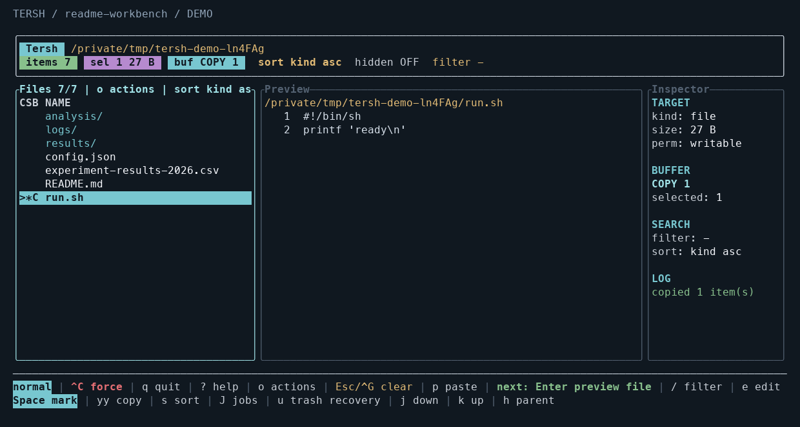
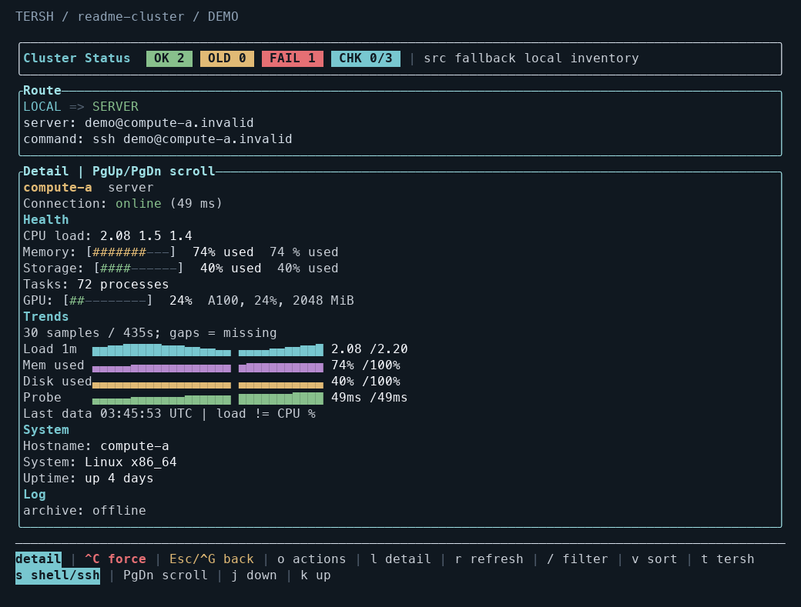

<a id="english"></a>

# Tersh

<picture>
  <source media="(prefers-color-scheme: dark)" srcset="docs/brand/tersh-logo-dark.svg">
  
</picture>

[](#english)
[](#中文)

[](https://github.com/QiushanHuang/Tersh/releases)
[](https://github.com/QiushanHuang/Tersh/actions/workflows/ci.yml)
[](https://www.rust-lang.org/)
[](LICENSE)

**Files, host health and recoverable actions — in the terminal you already use.**

When a quick check turns into `ls` → `cd` → `cat` → `cp` → another SSH session,
the friction is keeping track of paths, targets and what finished. Tersh brings
that everyday interactive work into a visible, keyboard-driven workflow.

## Why choose Tersh?

**Choose Tersh when you spend more time inspecting and organizing remote files
than you want to spend retyping paths or switching tools.** Its advantage is the
combination: a file workbench, an SSH host overview and explicit operation results,
with the same controls available in a laptop terminal or a phone's SSH session.

| Friction in a familiar workflow | What Tersh changes | What you gain |
| --- | --- | --- |
| Repeated shell commands mean re-entering paths and tracking selected targets yourself. | Browse, filter, preview, select and act in one view. | Less repetitive typing during interactive file work. |
| A desktop file manager may require another connection or workflow when you are already in an SSH-only session. | Run Tersh where the files live, through your existing terminal connection. | A visual file workflow without leaving that session. |
| Host-health checks and file inspection are often separate steps in separate tools. | `tersh --c` shows hosts and routes; `t` opens Tersh on the selected host. | A direct path from choosing a machine to inspecting its files. |
| Ad-hoc copies and cleanup leave you checking what completed and where deleted items went. | Background jobs report partial results; managed trash records the original location. | Clearer outcomes, cancellation and no-overwrite recovery. |
| Long shortcut lists and dense views are awkward on a small SSH screen. | `o` searches actions; hints adapt to the page and effective keymap. | More discoverable controls across different keyboards and widths. |

### Useful in the moments that matter

- **Checking a development or research server:** filter hosts, open the chosen
  workbench, inspect output directories and search a log without downloading it.
- **Handling an urgent check from a phone:** connect with your SSH client, run
  `tersh` on the server, and use compact hints or the action menu to reach a file.
- **Organizing a local project or remote workspace:** preview before acting,
  select several files, watch a copy job, or recover a managed trash entry later.

### A quick tour

| Need to… | Start with… |
| --- | --- |
| Inspect a file before opening an editor | `tersh`, then Enter for preview and `/` to search |
| Keep browsing during a copy | Copy/paste, `J` for progress, Ctrl+X to request cancellation |
| Recover an item you trashed with Tersh | `u`, review its original path, confirm restore |
| Pick a host and get to work | `tersh --c`, `/` to filter, `l` for detail, `t` for its workbench |
| Find an unfamiliar action | `o`, type its name, then select and execute |

**A small footprint by design:** one executable, bounded caches and host history,
change-driven redraws, and no resident monitoring agent. Prebuilt macOS/Linux
packages do not need a Rust toolchain to run. Health checks need SSH;
opening the remote file workbench also needs Tersh installed there. File operations
run on the host where that workbench is running.

<details>
<summary>How it fits alongside other tools</summary>

Shell commands remain a strong choice for scripts and repeatable automation.
[Yazi](https://yazi-rs.github.io/features/) offers a rich file-preview and plugin
ecosystem; [btop](https://github.com/aristocratos/btop) focuses on detailed system
resource monitoring. Tersh connects host selection, file inspection, operations,
results and recovery in one familiar terminal workflow. Use it for everyday
checks and file organization, and keep these tools alongside it for automation,
additional previews or deeper resource analysis.

</details>



*Screenshots use synthetic demo data and a representative terminal color palette.*

## Install

Download a binary for your platform from [Releases](https://github.com/QiushanHuang/Tersh/releases),
or build from source with **Rust 1.88 or newer**:

```sh
cargo install --locked --git https://github.com/QiushanHuang/Tersh.git --tag v1.2.0 --bin tersh
```

To update an existing Cargo installation, add `--force`. For a local checkout:

```sh
git clone https://github.com/QiushanHuang/Tersh.git
cd Tersh
./scripts/install.sh
```

The installer uses an existing Tersh location or a writable user bin directory.
Set `TERSH_INSTALL_DIR` to choose a location. For remote file work, install Tersh
on the remote host and run it after connecting through your SSH client.

## Start here

```sh
tersh                                  # Browse the current directory
tersh /path/to/project                 # Browse another directory
tersh README.md                        # Preview a file
tersh --c                              # Host health dashboard
tersh --ui-profile desktop             # Rounded borders and Unicode trends
tersh --ui-profile mobile --theme contrast
tersh --ui-profile ssh                 # ASCII, adaptive hints, no animation
```

Press **`o`** for searchable actions or **`?`** for the current keymap.
Type an action name, select it with arrows/Tab, and press Enter. Escape returns
to the previous view. The following are defaults; custom bindings also update
menus, help and footer hints.

| Task | Keys |
| --- | --- |
| Move / open / parent | `j`/`k` or arrows · Enter · `h` or Backspace |
| Filter / hidden files / sort | `/` · `.` · `s`/`S` |
| Select / copy / cut / paste | Space · `yy` · `x` · `p` |
| Copy to / move to / rename | `c` · `m` · `n` |
| Jobs / request cancellation | `J` · Ctrl+X |
| Trash / recover / permanent delete | `d` · `u` · `D` |
| Preview search / next match / edit | `/` · `n`/`N` · `e` |
| Copy name / relative path / absolute path | `yf` · `yr` · `ya` |
| Quit / cancel / safe emergency exit | `q` · Esc or Ctrl+G · Ctrl+C |

Tersh uses `$VISUAL`, `$EDITOR`, then `nano` for editing. For a visual `cd`, source
[scripts/tersh-cd.sh](scripts/tersh-cd.sh) in your shell and use `tersh-cd`.

## File jobs and recovery

File jobs such as copying and moving run in the background while you continue
browsing. Press `J` to see progress and find out which items finished or need
attention. Use Ctrl+X when you need to stop a job. Tersh runs one file job at a
time to keep its progress and results easy to follow.

For everyday cleanup, use `d` to move items to trash and `u` to browse recovery
records. Select an item, review its original location and confirm the restore.
If that location already contains an item with the same name, Tersh reports the
conflict so you can handle the existing file first. Records remain available
when you reopen Tersh in the same work directory.

Copy conflicts offer skip or confirmed file replacement, and permanent deletion
requires a typed confirmation. See [configuration](docs/configuration.md#file-operation-boundaries)
for detailed file-operation and recovery behavior.

## Hosts and trends



```sh
tersh --c --cluster-config examples/servers.json
```

Edit a copy of [the example inventory](examples/servers.json) with your own
hosts. Its `.example` addresses are placeholders. Health probes use
non-interactive SSH with already trusted host keys and existing credentials.

| Task | Keys |
| --- | --- |
| Filter alias, address or role / clear filter | `/` · Backspace |
| Cycle sort / reverse | `v` · `V` |
| Refresh all / refresh selected | `r` · Enter |
| Expand detail / scroll detail | `l` · PageUp/PageDown |
| Open shell or SSH / open Tersh | `s` · `t` |

Use filtering and sorting to find the hosts you care about while health checks
continue across your inventory. Install Tersh on a remote host, press `t` to open
its file workbench, and return to the dashboard when you finish.

See the latest 60 observations for each host to follow changes in load, memory,
storage and probe duration. Graphs show the elapsed span and gaps for missing
data, reusing existing probe results to keep monitoring lightweight.

## Make it yours

```sh
tersh --theme aurora
tersh --theme mono
tersh --no-motion
tersh --dump-keymap > keymap.json
tersh --keymap keymap.json
```

Themes: `btop`, `aurora`, `contrast`, `mono`. `NO_COLOR` disables colors.
Use the desktop, mobile and SSH presets to quickly choose borders, graph glyphs,
shortcut density and motion that suit your current terminal.

Custom bindings use a partial JSON map:

```json
{
  "files": {
    "copy": ["Ctrl+y"],
    "open_jobs": ["F5", "J"],
    "open_trash": ["F6", "u"]
  }
}
```

This replaces `yy` with Ctrl+Y and keeps single-letter alternatives for devices
without function keys. See [configuration](docs/configuration.md) for all ten
contexts, file precedence, chords, environment variables and inventory fields.

## Develop and contribute

```sh
cargo fmt --check
cargo clippy --locked --all-targets -- -D warnings
cargo test --locked --all-targets
python3 -m unittest discover -s scripts/tests -p 'test_*.py'
```

[Contributing](CONTRIBUTING.md) · [Changelog](CHANGELOG.md) ·
[v1.2.0 release notes](docs/releases/v1.2.0.md)

Maintained by [QiushanHuang](https://github.com/QiushanHuang).
See [contributors and attribution](CONTRIBUTORS.md). Tersh is licensed under the
[MIT License](LICENSE).

---

<a id="中文"></a>

## 中文

<picture>
  <source media="(prefers-color-scheme: dark)" srcset="docs/brand/tersh-logo-dark.svg">
  
</picture>

[](#english)
[](#中文)

**文件、主机状态与可恢复的操作，都在你正在使用的终端里。**

一次简单检查，经常变成 `ls` → `cd` → `cat` → `cp` → 切换另一台服务器。
反复输入路径、确认操作对象、核对任务结果，才是这些日常工作中容易累积的成本。
Tersh 把它们组织成一个可见、可搜索、可用键盘完成的操作流程。

### 为什么选 Tersh？

**如果你经常在本地或 SSH 中检查和整理文件，希望少输路径、少切工具、看清操作结果，
Tersh 就是为这类工作准备的。** 它的优势在于把文件工作台、SSH 主机概览和明确的任务反馈
放在一起，并让这套操作能适应笔记本终端与手机 SSH 会话。

| 现有工作方式容易遇到的问题 | Tersh 的做法 | 直接收益 |
| --- | --- | --- |
| 用一串命令交互式浏览文件，要反复输入路径、自己记住操作对象。 | 在同一视图中浏览、筛选、预览、选择并操作。 | 减少重复输入，让当前目标更直观。 |
| 已经连上 SSH，却还要为桌面文件管理器切换连接或另起一套操作流程。 | 在文件所在的机器上运行，沿用现有终端连接。 | 留在当前会话中完成可视化文件操作。 |
| 看主机状态和处理文件往往分散在不同工具、不同步骤里。 | `tersh --c` 查看主机与路由，按 `t` 进入选中主机的文件工作台。 | 从选机器到看文件衔接起来。 |
| 临时复制、清理后，还要重新核对哪些完成了、删掉的文件原来在哪里。 | 后台任务报告部分完成结果；受管理的回收站记录原位置。 | 结果可见，任务可取消，恢复不覆盖同名目标。 |
| 手机 SSH 屏幕窄、键盘不全，长快捷键列表难记又难用。 | `o` 搜索操作；底部提示跟随页面和实际键位变化。 | 更容易找到操作，适配不同设备。 |

#### 什么时候特别有用？

- **检查开发或科研服务器**：筛选主机、进入工作台、查看输出目录、搜索日志，不必先把文件下载回来。
- **用手机临时处理问题**：通过常用 SSH 客户端连接，在服务器上运行 `tersh`，用紧凑提示或操作菜单找到文件。
- **整理本地项目或远端工作目录**：先预览再操作，多选复制时继续浏览，需要时查看进度或恢复之前移入回收站的项目。

#### 半分钟了解主要功能

| 你想做什么 | 从这里开始 |
| --- | --- |
| 打开编辑器前先确认文件内容 | `tersh`，Enter 预览，`/` 查找 |
| 复制时继续浏览，并掌握进度 | 复制/粘贴，`J` 查看任务，Ctrl+X 请求取消 |
| 恢复用 Tersh 移入回收站的项目 | `u`，查看原路径后确认恢复 |
| 找到目标服务器并开始处理文件 | `tersh --c`，`/` 筛选，`l` 查看详情，`t` 进入工作台 |
| 不记得某项操作的快捷键 | `o` 搜索名称，再选择执行 |

**轻量有具体设计支撑**：单个可执行文件、有界缓存与主机历史、按变化重绘，没有常驻监控代理。
预编译的 macOS/Linux 程序无需 Rust 工具链即可运行。健康检查需要 SSH；打开远端文件工作台还需要在目标机器安装 Tersh。
文件操作发生在该工作台所在的主机上。

<details>
<summary>与其他工具如何搭配、各自适合什么</summary>

脚本和重复自动化仍适合直接用 shell 命令。
[Yazi](https://yazi-rs.github.io/features/) 提供丰富的文件预览与插件生态，
[btop](https://github.com/aristocratos/btop) 专注于详细的系统资源监控。
Tersh 把“选主机 → 检查文件 → 执行操作 → 查看结果与恢复”串成一条连贯的工作路径。
日常检查和整理文件时，你可以在熟悉的终端里完成这些步骤，减少来回切换和重复输入；
需要编写自动化脚本、扩展预览或深入分析资源时，也可以继续搭配这些工具使用。

</details>


*截图使用模拟数据；实际颜色由终端配色决定。*

### 安装

从 [Releases](https://github.com/QiushanHuang/Tersh/releases) 下载对应平台的程序，
或使用 **Rust 1.88 及以上版本**从源码安装：

```sh
cargo install --locked --git https://github.com/QiushanHuang/Tersh.git --tag v1.2.0 --bin tersh
```

更新已有 Cargo 安装时加 `--force`。也可以克隆后运行安装脚本：

```sh
git clone https://github.com/QiushanHuang/Tersh.git
cd Tersh
./scripts/install.sh
```

脚本优先使用已有安装位置，否则选择可写的用户 bin 目录。
可用 `TERSH_INSTALL_DIR` 指定位置。远程文件操作需在服务器上安装 Tersh，
然后通过常用 SSH 客户端登录运行。

### 快速开始

```sh
tersh
tersh /path/to/project
tersh README.md
tersh --c
tersh --ui-profile desktop
tersh --ui-profile mobile --theme contrast
tersh --ui-profile ssh
```

按 **`o`** 搜索操作，按 **`?`** 查看当前键位。操作菜单中输入名称，
用方向键/Tab 选择、Enter 执行、Esc 返回。以下为默认键位；自定义后，
菜单、帮助和底部提示会同步更新。

| 操作 | 默认键位 |
| --- | --- |
| 移动 / 打开 / 上级目录 | `j`/`k` 或方向键 · Enter · `h` 或 Backspace |
| 筛选 / 隐藏文件 / 排序 | `/` · `.` · `s`/`S` |
| 选择 / 复制 / 剪切 / 粘贴 | Space · `yy` · `x` · `p` |
| 复制到 / 移动到 / 重命名 | `c` · `m` · `n` |
| 任务与结果 / 请求取消 | `J` · Ctrl+X |
| 移入回收站 / 恢复 / 永久删除 | `d` · `u` · `D` |
| 预览查找 / 下一个匹配 / 编辑 | `/` · `n`/`N` · `e` |
| 复制文件名 / 相对路径 / 绝对路径 | `yf` · `yr` · `ya` |
| 退出 / 取消 / 安全紧急退出 | `q` · Esc 或 Ctrl+G · Ctrl+C |

编辑器依次使用 `$VISUAL`、`$EDITOR`、`nano`。
需要可视化 `cd` 时，在 shell 中加载 [tersh-cd.sh](scripts/tersh-cd.sh)，
然后使用 `tersh-cd`。

### 后台任务与恢复

复制、移动等文件任务在后台进行，你可以继续浏览和查找文件。
按 `J` 查看进度，了解哪些项目已经完成、哪些需要处理；需要中途停止时，按 Ctrl+X。
Tersh 每次执行一项文件任务，让进度和结果更容易跟踪。

整理文件时，可以先用 `d` 移入回收站，之后按 `u` 查看记录。
选择一项后，Tersh 会显示它的原位置，确认后即可恢复。
如果原位置已有同名项目，界面会提示冲突，方便你先处理现有文件。
关闭应用后，回到同一工作目录仍可查看这些恢复记录。

同名文件复制时可选择跳过或确认替换，永久删除需要输入确认词。
更多文件处理与恢复规则见[配置说明](docs/configuration.md#file-operation-boundaries)。

### 主机与趋势


```sh
tersh --c --cluster-config examples/servers.json
```

先复制并编辑[清单示例](examples/servers.json)，填入自己的主机。
示例中的 `.example` 地址仅作占位。健康探测使用非交互 SSH、已有凭据和已信任的主机密钥。

| 操作 | 默认键位 |
| --- | --- |
| 按别名、地址、角色筛选 / 清除 | `/` · Backspace |
| 切换排序 / 反转 | `v` · `V` |
| 刷新全部 / 刷新选中主机 | `r` · Enter |
| 展开详情 / 滚动详情 | `l` · PageUp/PageDown |
| 打开 shell/SSH / 打开远端 Tersh | `s` · `t` |

用筛选和排序快速找到关注的主机，完整清单的健康检查会继续进行。
在目标主机安装 Tersh 后，按 `t` 即可进入它的文件工作台，退出后回到主机面板。

每台主机展示最近 60 次观测，帮助你快速了解负载、内存、磁盘和探测耗时的变化。
图中标明时间跨度，并用缺口区分缺失数据；趋势直接使用已有探测结果，保持轻量。

### 配色与键位

```sh
tersh --theme aurora
tersh --theme mono
tersh --no-motion
tersh --dump-keymap > keymap.json
tersh --keymap keymap.json
```

主题包括 `btop`、`aurora`、`contrast`、`mono`；`NO_COLOR` 关闭颜色。
通过桌面、移动端、SSH 预设，可以快速选择适合当前设备的边框、图形字符、提示密度和动效。

自定义键位只需覆盖需要的部分：

```json
{
  "files": {
    "copy": ["Ctrl+y"],
    "open_jobs": ["F5", "J"],
    "open_trash": ["F6", "u"]
  }
}
```

这会用 Ctrl+Y 替换原来的 `yy`，同时为缺少功能键的设备保留单字母入口。
完整上下文、配置优先级、组合键、环境变量和主机字段见[配置说明](docs/configuration.md)。

### 开发与贡献

```sh
cargo fmt --check
cargo clippy --locked --all-targets -- -D warnings
cargo test --locked --all-targets
python3 -m unittest discover -s scripts/tests -p 'test_*.py'
```

[贡献指南](CONTRIBUTING.md) · [更新记录](CHANGELOG.md) ·
[v1.2.0 说明](docs/releases/v1.2.0.md)

维护者：[QiushanHuang](https://github.com/QiushanHuang)。
贡献署名见 [CONTRIBUTORS.md](CONTRIBUTORS.md)。采用 [MIT 许可](LICENSE)。
