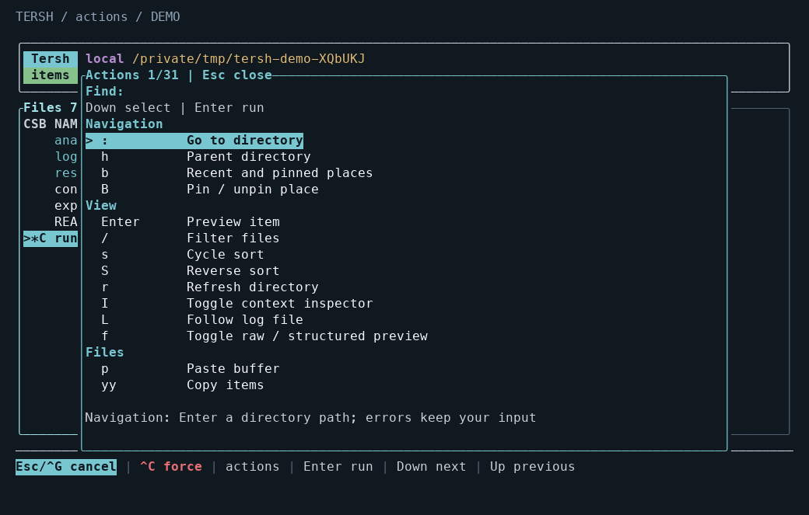
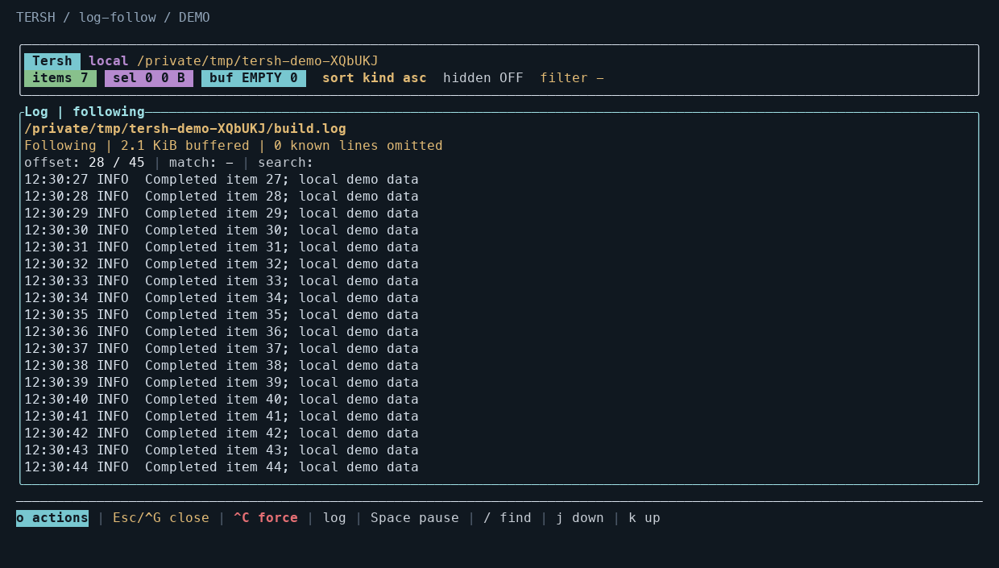
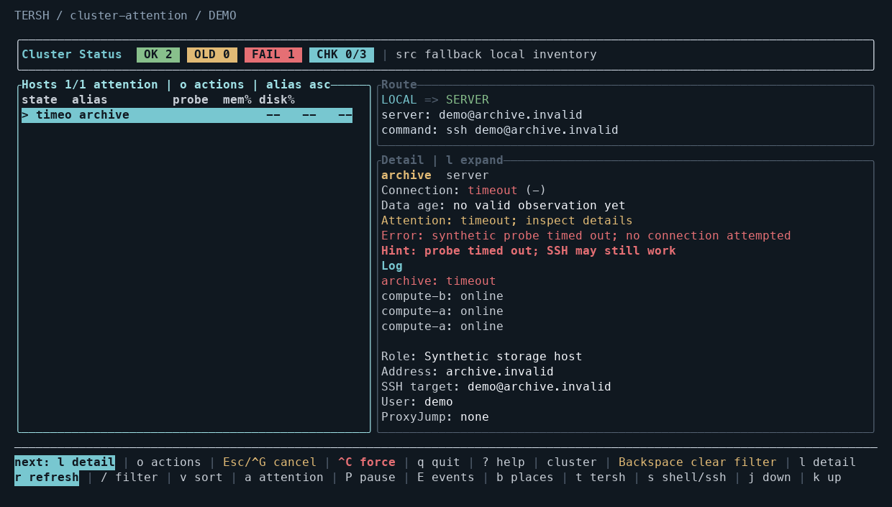

<a id="english"></a>

# Tersh workflow update

[English](#english) · [简体中文](#中文) · [README](../README.md)

Choose a host, return to a working directory, inspect its output, then handle the
result of a file operation. These changes make that everyday Tersh workflow
easier to continue without re-entering paths or losing your place.

This guide describes **development version `1.3.0-dev.1`**. These additions are
**not included in the v1.2.0 tag** and do not constitute a new tagged release.

## Try the new controls

The table uses default keys. Custom bindings also update the action menu, help
and footer hints.

| What you want to do | Where and keys | What happens |
| --- | --- | --- |
| Return to a directory | Files: `b`, `B` | Search recent/pinned places; pin or unpin the current directory. |
| Choose a saved host directory | `--c`: `b`, `B` | Search host/path pairs; pin the selected host's configured `workdir`. A saved target must still match that host's connection identity. |
| Read new log output | Files/preview: `L`; then Space, `/`, `n`/`N` | Follow a bounded tail. Scrolling or searching pauses following; Space resumes it. |
| Read structured content | Files/preview: `f` | Switch raw text and formatted JSON, quoted CSV or unified diff. |
| Handle a previous task | `J`; then `[`/`]`, `f`, `r`, `e` | Browse this session's results, filter unresolved items, request a validated retry or export a new JSON file. |
| Find a host needing attention | `--c`: `a`, `E`, `P` | Filter unknown, old or warning data; inspect state changes; pause automatic refresh. Manual refresh remains available. |
| Find an action or reduce clutter | `o`, `?`, `I` | Search grouped actions, read effective keys or fold the wide-screen inspector. |

Directory and preview reads use background workers. You can keep using the
keyboard while a read is pending, and a late result cannot replace a newer
selection. Returning to a parent focuses the directory you just left. A failed
path entry stays available for correction.

In the locations view, Ctrl+B toggles the selected pin and Ctrl+D forgets a saved
record. Ctrl+L clears recent entries while retaining pins. In `--c`, it acts on
the highlighted place's host. These controls change saved metadata, not folders.
Set `TERSH_PLACES=off` to disable location history and pins.

## Bounded work and clear results

| Data | Limit or behavior |
| --- | --- |
| Saved places | 128 entries, up to 64 pins and 64 KiB of private state; separate host identities; no history synchronization. |
| Task history | Latest 20 results in memory; 1 MiB total retained data and 64 KiB per entry. Counts remain complete when details are omitted. |
| Log following | Up to 64 KiB per automatic read, scheduled at most four times per second; a 2,000-line / 256 KiB buffer. |
| Structured previews | 256 KiB input/output and 2,000 content lines; 512 display columns, with CSV limited to 32 columns. Invalid or oversized input has an explicit bounded raw fallback. |
| Host views | Last valid values stay visible while checking, with data age and errors. Attention and charts use existing observations. |

Retries include failed and remaining items only. They clear earlier overwrite
decisions and repeat the source, destination and confirmation checks. If the
necessary retry paths were omitted, Tersh refuses a partial retry. Cancellation
keeps already completed work; export writes a new file and never overwrites one.
Task history ends with the session. Managed trash recovery remains persistent.

Log search covers the retained buffer. Pausing freezes the displayed view and
stops scheduling further reads; a read already in progress may finish. Rotation,
observed shortening and read errors are reported. Truncation followed by rapid
regrowth beyond the old offset between polls can escape detection.

JSON formatting preserves number tokens, duplicate fields, field order and
string escapes. Raw text remains available. Host graphs show observation order
with missing-data gaps; they do not imply equally spaced measurements. Load is
not CPU utilization, and probe duration includes more than network latency.

The application remains a TUI with ASCII, no-color and no-motion options. No
runtime dependency or resident monitoring service was added. Places metadata
saves and explicit result exports remain synchronous small-file operations;
blocking filesystem calls cannot promise instantaneous cancellation. See the
[configuration reference](configuration.md) for settings and operation limits.

## Measured macOS comparison

These measurements describe the macOS arm64 candidate tested on 2026-10-02,
compared with source baseline `e25f709` on the same machine and fixtures. The
candidate uses `opt-level=s` and fat LTO, so the build profile is an intentional
difference. Launches start a new process without flushing the OS file cache.

| Measurement | Baseline | Measured candidate |
| --- | ---: | ---: |
| Executable size | 1,851,456 bytes | 1,748,384 bytes, 5.6% smaller |
| 1,000-file list ready and action menu responsive, P95 of 30 launches | 8.13 ms | 28.80 ms |
| Action-menu response, P95 | 0.48 ms | 0.84 ms |
| 1,000-file sampled RSS, median | 5,040 KiB | 4,976 KiB |
| Output during 600 seconds of idle file browsing | 0 bytes | 0 bytes |

Startup took about 20 ms longer in this small-directory fixture. The benefit of
the new read workers is keeping slow directory and preview I/O out of the input
loop. These measurements do not show every operation becoming faster. RSS is
sampled memory, not peak memory, and local timings do not measure SSH transport.

## Native Linux comparison

The Linux comparison rebuilt `e25f709` and the candidate with Rust 1.95.0,
`x86_64-unknown-linux-gnu`, `opt-level=s` and fat LTO on the same Ubuntu 24.04.4
host. The older installed musl binary uses different compiler/link settings and
is not used to attribute feature overhead.

| Measurement | Matched baseline | Optimized candidate |
| --- | ---: | ---: |
| Executable size (same GNU build settings) | 1,656,688 bytes | 1,942,088 bytes |
| 1,000-file startup P95 (30 launches) | 13.29 ms | 38.30 ms |
| Menu response P95 | 1.21 ms | 2.14 ms |
| 1,000-file sampled RSS median | 4,584 KiB | 4,782 KiB |
| 100,000-file first list, single run | 461 ms | 449 ms |
| 100,000-file sampled RSS | 83,808 KiB | 71,200 KiB |

Skipping a temporary full-directory path set when nothing is marked reduced the
candidate's 100,000-file first-list sample from 1,280 ms to 450 ms. Single-run
large-directory values are workload samples, not P95 estimates or promises for
all filesystems. Final installed-artifact measurements are available in the
[validation summary](product-evolution-validation.json).

Both final installed builds produced zero terminal output and unchanged sampled
RSS during 600 seconds of idle browsing. The observed CPU-time deltas were
0.04 seconds on macOS and 0.00 seconds on Linux at `ps` display precision.

SSH acceptance uses disposable remote state and a controlled bash without user
rc files. The actual Tersh workbench command is retained. The QA decoder reports
Darwin's transient pending-input state separately from terminal configuration;
a standalone OpenSSH control established that distinction. These tests do not
validate arbitrary shell customization or GUI/mobile font appearance.

## Validation status

The measured macOS candidate passed 364 Rust tests, 113 Python tests, formatting,
strict Clippy and an optimized build. Local PTY checks exercised keyboard flows,
resizing and terminal restoration. Synthetic buffer tests cover 40/80/120/160
columns. These checks do not establish mobile-client, terminal-font or human
usability acceptance.

<!-- publication-validation-en:start -->
| Follow-up | Status |
| --- | --- |
| Local installed binary | Both existing command paths now report `1.3.0-dev.1`; checksums match the rebuilt artifact and installed-path keyboard workflows passed. |
| Native Linux validation | Ubuntu 24.04.4 x86_64: 365 Rust tests, 113 Python tests, formatting, strict Clippy, release build and both native PTY suites passed. The installed command reports `1.3.0-dev.1`. |
| Real SSH workflow validation | Passed over an existing jump route: Unicode input/editing, direct and nested 40/80/120-column resize, `--c → t/s → dashboard`, positive host probe, and local/remote terminal configuration restoration. |
<!-- publication-validation-en:end -->

Check out the development PR branch before building these additions. To check it locally:

```sh
cargo test --locked --all-targets
cargo clippy --locked --all-targets -- -D warnings
cargo build --locked --release --bin tersh
./target/release/tersh
python3 scripts/verify-product-pty.py target/release/tersh target/product-pty-check.json
```

See the [demo screens](#demo-screens) below. All displayed files, logs and hosts
are synthetic fixtures.

<a id="中文"></a>

# Tersh 工作流程更新

[English](#english) · [简体中文](#中文) · [README](../README.md#中文)

选一台主机，回到工作目录，查看输出，再处理文件操作的结果。这次更新让这些日常步骤更容易接着做，减少重复输入路径和重新寻找位置。

本文介绍**开发版本 `1.3.0-dev.1`**。这些新增功能**不包含在 v1.2.0 标签中**，也不代表已经发布新的正式版本。

## 新的常用操作

以下是默认键位。自定义后，操作菜单、帮助和底部提示会同步更新。

| 你想做什么 | 位置与键位 | 使用方式 |
| --- | --- | --- |
| 返回某个目录 | 文件页：`b`、`B` | 搜索最近/固定地点；固定或取消固定当前目录。 |
| 选择某台主机上的目录 | `--c`：`b`、`B` | 搜索主机与路径；固定选中主机配置的 `workdir`。保存的地点必须仍与当前连接身份匹配。 |
| 阅读新产生的日志 | 文件页/预览：`L`，之后 Space、`/`、`n`/`N` | 查看有界的日志尾部。滚动或查找会暂停跟随，Space 继续。 |
| 查看结构化内容 | 文件页/预览：`f` | 切换原文与 JSON、CSV、unified diff 预览。 |
| 处理之前的任务 | `J`，之后 `[`/`]`、`f`、`r`、`e` | 浏览本次会话的结果，筛选未完成项，重新核验后重试，或导出新的 JSON 文件。 |
| 找到需要处理的主机 | `--c`：`a`、`E`、`P` | 筛选未知、过期或告警数据，查看状态变化，暂停自动刷新；仍可手动刷新。 |
| 查找操作或收起信息 | `o`、`?`、`I` | 搜索分组动作，查看实际键位，折叠宽屏检查面板。 |

目录与预览在后台读取。等待时仍可操作键盘，迟到的结果不会覆盖新选择。返回上级目录会选中刚离开的子目录；路径输入失败后，可以直接修改原输入。

地点页中，Ctrl+B 切换固定状态，Ctrl+D 忘记所选记录，Ctrl+L 清理最近记录并保留固定项。在 `--c` 中，清理范围是高亮地点所属的主机。这些动作只修改保存的元数据。设置 `TERSH_PLACES=off` 可关闭地点历史与固定功能。

## 资源上限与结果处理

| 数据 | 上限或行为 |
| --- | --- |
| 保存的地点 | 128 条记录，最多 64 项固定地点、64 KiB 私有状态；按主机身份隔离，不同步历史。 |
| 任务历史 | 内存保留最近 20 项结果，总数据上限 1 MiB，每项 64 KiB。省略细节时仍保留完整统计。 |
| 日志跟随 | 每次自动读取最多 64 KiB，每秒最多调度四次；缓冲最多 2,000 行 / 256 KiB。 |
| 结构化预览 | 输入/输出最多 256 KiB、2,000 行内容、512 显示列；CSV 最多 32 列。无效或过大的输入会明确回退到有界原文。 |
| 主机视图 | 检查期间保留上次有效读数，分别显示数据年龄与错误；告警筛选和图表复用已有观测。 |

重试只处理失败和剩余项，清除旧覆盖决定，并重新检查源、目标与确认条件。如果必要路径已被省略，会拒绝只重试其中一部分。取消保留已经完成的操作；结果导出只创建新文件。本次会话结束后，普通任务历史消失；受管理的回收恢复记录仍然持久保存。

日志查找只覆盖当前缓冲。暂停会冻结画面并停止安排后续读取，已经开始的读取可能继续完成。程序会报告观测到的轮转、缩短和读取错误；两次读取之间先截断、又快速增长超过旧位置的文件，可能无法识别为轮转。

JSON 格式化保留原数字、重复字段、字段顺序与字符串转义，仍可切回原文。主机图表按观测顺序排列，并保留缺失数据的空档；横向等距不代表采样时间等距。负载不是 CPU 使用率，探测耗时也不只是网络延迟。

Tersh 仍是终端 TUI，保留 ASCII、无色和关闭动效的选项，没有新增运行依赖或常驻监控服务。地点保存和显式结果导出仍是同步的小文件操作；阻塞的文件系统调用不能保证即时取消。设置与操作边界见[配置说明](configuration.md)。

## macOS 本地测量

以下数据来自 2026-10-02 测试的 macOS arm64 候选构建，与同机、同夹具的 `e25f709` 基线比较。候选构建使用 `opt-level=s` 与 fat LTO，构建配置的变化属于这次比较的一部分。每次启动新进程，没有清空操作系统文件缓存。

| 项目 | 基线 | 实测候选构建 |
| --- | ---: | ---: |
| 可执行文件 | 1,851,456 字节 | 1,748,384 字节，缩小 5.6% |
| 1,000 项文件列表可用且菜单响应，30 次启动的 P95 | 8.13 ms | 28.80 ms |
| 操作菜单响应 P95 | 0.48 ms | 0.84 ms |
| 1,000 项文件时的采样 RSS 中位数 | 5,040 KiB | 4,976 KiB |
| 文件页静止 600 秒的终端输出 | 0 字节 | 0 字节 |

这个小目录夹具的启动时间增加了约 20 ms。后台读取的收益是把慢目录与预览 I/O 移出输入循环。这组结果不表示所有操作都变快了。RSS 是采样值，不是峰值；本地时延也不代表 SSH 传输时延。

## 原生 Linux 对照

在同一台 Ubuntu 24.04.4 主机上，用 Rust 1.95.0、GNU target、`opt-level=s` 和 fat LTO 重新构建 `e25f709` 与候选程序。之前安装的 musl 程序使用不同编译器及链接方式，因此不把它们的全部差值归因于新增功能。

| 项目 | 同配置基线 | 优化后的候选程序 |
| --- | ---: | ---: |
| 可执行文件（同 GNU 构建设置） | 1,656,688 字节 | 1,942,088 字节 |
| 1,000 项启动 P95（30 次） | 13.29 ms | 38.30 ms |
| 菜单响应 P95 | 1.21 ms | 2.14 ms |
| 1,000 项采样 RSS 中位数 | 4,584 KiB | 4,782 KiB |
| 十万项目录首个列表，单次测量 | 461 ms | 449 ms |
| 十万项采样 RSS | 83,808 KiB | 71,200 KiB |

没有标记文件时跳过临时路径集合，将候选程序的十万项目录首屏样本从 1,280 ms 降到 450 ms。大目录单次结果不是 P95，也不代表所有文件系统的表现；最终安装产物数据见[验证摘要](product-evolution-validation.json)。

最终两端安装程序在 600 秒静止浏览中均无终端输出，采样 RSS 未增长。`ps` 显示精度下，CPU 时间差为 macOS 0.04 秒、Linux 0.00 秒。

SSH 验收使用可丢弃的远端状态与不加载用户 rc 的受控 bash，保留 Tersh 实际生成的工作台命令。测试会单独记录 macOS 临时的 pending-input 状态位，并检查终端配置恢复；普通 OpenSSH 对照验证了这一差异。验收范围不包括任意 shell 定制或 GUI/手机客户端字体外观。

## 验证状态

实测 macOS 候选构建通过 364 项 Rust 测试、113 项 Python 测试、格式检查、严格 Clippy 和优化构建。本地 PTY 检查覆盖键盘流程、尺寸变化和终端状态恢复；合成缓冲测试覆盖 40/80/120/160 列。这些检查不等于手机客户端、终端字体或真实用户可用性验收。

<!-- publication-validation-zh:start -->
| 后续检查 | 状态 |
| --- | --- |
| 本机安装程序 | 两个已有命令入口均为 `1.3.0-dev.1`，哈希与重建产物一致，安装路径上的键盘流程已通过。 |
| 原生 Linux 验证 | Ubuntu 24.04.4 x86_64：365 项 Rust、113 项 Python、格式检查、严格 Clippy、release 构建及两套原生 PTY 检查通过；安装命令为 `1.3.0-dev.1`。 |
| 真实 SSH 使用流程 | 已通过现有跳板路由：中文输入/编辑、直接及嵌套 40/80/120 列缩放、`--c → t/s → dashboard`、主机探测成功及两端终端配置恢复。 |
<!-- publication-validation-zh:end -->

本地源码检查命令见[英文部分](#validation-status)，也可参考[贡献说明](../CONTRIBUTING.md)。

<a id="demo-screens"></a>

## Demo screens / 演示画面

These images render actual Tersh terminal cells with synthetic data and a
representative ANSI palette. Each is marked **DEMO**. They are not captures of a
desktop GUI, a phone client or a live server.

以下画面由 Tersh 的实际终端单元格与合成数据生成，采用代表性的 ANSI 配色，均标有 **DEMO**。它们不是桌面 GUI、手机客户端或真实服务器的截图。






